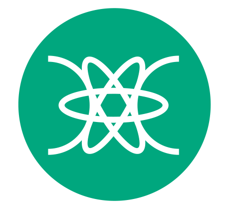

<!--
**RafaelWurzius/RafaelWurzius** is a ✨ _special_ ✨ repository because its `README.md` (this file) appears on your GitHub profile.

Here are some ideas to get you started:

- 🔭 I’m currently working on ...
- 🌱 I’m currently learning ...
- 👯 I’m looking to collaborate on ...
- 🤔 I’m looking for help with ...
- 💬 Ask me about ...
- 📫 How to reach me: ...
- 😄 Pronouns: ...
- ⚡ Fun fact: ...

 Técnico em Informática pelo IFC - Campus Videira
 Cursando Ciência da Computação  pelo IFC - Campus Videira

 
-->
## Oi 👋

 Técnico em Informática pelo IFC - Campus Videira
  Cursando Ciência da Computação  pelo IFC - Campus Videira

 
  
  
  
  
  
  
  

<link rel="stylesheet" type='text/css' href="https://cdn.jsdelivr.net/gh/devicons/devicon@latest/devicon.min.css" />

