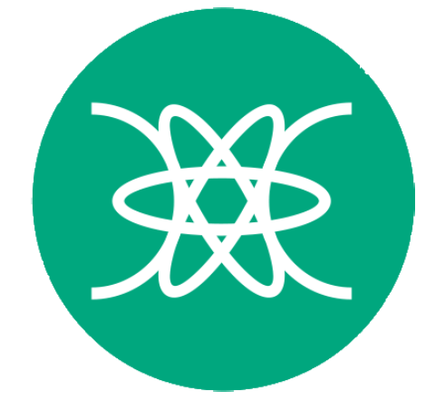

<!--
**RafaelWurzius/RafaelWurzius** is a ✨ _special_ ✨ repository because its `README.md` (this file) appears on your GitHub profile.

Here are some ideas to get you started:

- 🔭 I’m currently working on ...
- 🌱 I’m currently learning ...
- 👯 I’m looking to collaborate on ...
- 🤔 I’m looking for help with ...
- 💬 Ask me about ...
- 📫 How to reach me: ...
- 😄 Pronouns: ...
- ⚡ Fun fact: ...
-->
### Oi 👋
Meu nome é **Rafael**, gosto de criar coisas novas e fazê-las funcionar.
(Principalmente com **JAVA** )

 Técnico em Informática pelo IFC - Campus Videira 

 &nbsp; &nbsp; Cursando Ciência da Computação pelo IFC - Campus Videira

 
  
  
  
  
  
  
  

 
 

---
### Projetos acadêmicos

- [🌐 Simulação de uma infraestrutura web](https://github.com/RafaelWurzius/infraestrutura_e_servicos_web)  
- [✈️ Algoritmo Genético para um problema de distribuição de cargas ](https://github.com/RafaelWurzius/algoritmoGenetico)  
- [🔎 Algoritmos de busca](https://github.com/RafaelWurzius/AlgoritmosDeBusca)  
- [📊 Dashbordas para visualização em tempo real de dados](https://github.com/RafaelWurzius/dashboard/blob/main/main.py)
- [#️⃣ Algorimo para a execução de braço mecânico simples que escreve e joga o jogo da velha](https://github.com/RafaelWurzius/ProjetoSistemasEmbarcados)
- [🎤 App de Karaokê ](https://github.com/RafaelWurzius/LPRG3_projeto2)
- [🐦 Jogo Pegue o Pomo](https://github.com/RafaelWurzius/PegueOPomo)
- [🎶 Jogo Que Som é Esse?](https://github.com/RafaelWurzius/que-som-e-esse)
- [🧮 Jogo Forme Equações ](https://github.com/RafaelWurzius/forme-equacoes)
